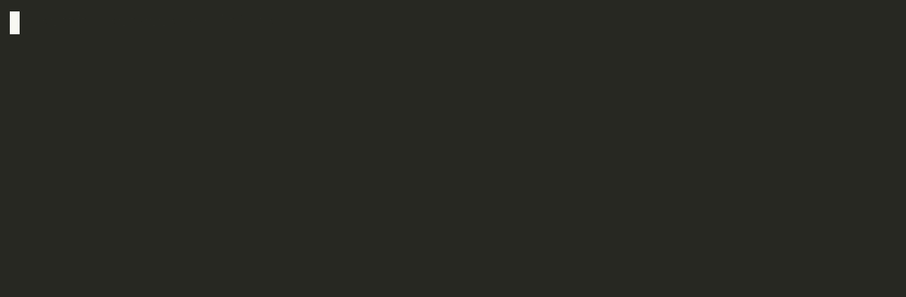

# Brainfuck compiler

This project parses brainfuck files, optimizes it, and generates debuggable [LLVM IR](https://llvm.org/), [QBE IL](https://c9x.me/compile/doc/il.html), C code, Javascript, native x86-64/ARM64 binaries, or Brainfuck output.

If you output LLVM IR and compile your binaries with clang, you can use the `lldb` debugger tool to step through your brainfuck source, while watching the assembly internals! And you can debug the memory with `p mem` or `p p[0]` for example, or find the current pointer location with `p p-mem` and of course output the assembly code with `disassemble`.



The initial idea came when I saw the Youtuber [tsoding](https://www.youtube.com/watch?v=JTjNoejn4iA) try out QBE, and the language looked very simple, so I thought it should be simple to use it to compile brainfuck. And then later I found out that LLVM IR isn't that hard either, to do basic stuff.

## Output formats

* LLVM Intermediate Representation
* QBE Intermediate Language
* C
* C with inline ARM64 machine code (`carm64`)
* C with inline x86-64 machine code (`camd64`)
* Rust
* Javascript (Node.js flavored)
* Brainfuck
* ARM64 Mach-O binary (direct, macOS only)
* x86-64 ELF binary (direct, Linux only)

## Optimizations

If you enable optimization, it optimizes the token stream before it generates code with the following optimalizations, output is explained with C for readability:

- Memory size (default 30KB) and cell size (32,16 or 8 bit) is configurable

- Multiple equal operations are aggregated, for example `++++` would generate `*p += 4` in C

- Opposing operations cancel eachother out. For example `+++--` would generate `*p++` in C

- If opposing operations "overflow" they swap operation, so `++---` would change the initial + operation that is being handeled into a - operation, so the resulting C in this case would be `*p--`

- Optimalization is re-run until no more optimization is possible, so that for example `++-->+->+->+-` would be optimized down to just `*p += 3`

- Second level optimalization; convert simple loops that only do maths, to multiplication instructions. For example; `++[>+++>++<<-]` would optimize to the following C code: `p[0] = 2; p[1] += *p * 3; p[2] += *p * 2;`. It also handles when the iterator is higher than 1; for example: `++[>>+++>++<<--]` would generate `p[0] = 2; p[0] =/ 2; p[2] += *p * 3; p[3] += *p * 2;`, so that the result would be half the last example.

- Added an `if` before the multiplication operations, in case the operation should not be done at all.

- Just after a loop, we know that *p is 0, so if there is a ADD/SUB operation just after that, we can set it directly. For example `[-]++` would translate to `*p = 2`instead of`*p = 0; *p += 2;`

- Scan loop optimization: `[>]` is converted to a SCANR instruction (scans right for a zero cell), and `[<]` is converted to SCANL (scans left). For C output, SCANR uses `memchr()` which on some standard libraries is optimized to check multiple bytes at a time. SCANL uses a simple pointer loop.

- Print loop optimization: `[.>]` is converted to a PRNT instruction. For 8-bit C output, this uses `fputs()` to let the standard library output the string optimally.

- After `*p = 0` assignments generated by the optimizer (e.g. from `[-]`), the optimizer tracks that the current cell is zero. This enables dead loop elimination after clear operations generated by earlier optimization passes.

- After second level optimization, the first level is re-run to consolidate adjacent operations that may have been exposed by dead loop removal (e.g. `>>>[-]>>>` where the `[-]` loop is eliminated, leaving `>>>>>>` which merges to `p += 6`).

- If a loop variable is cleared before the loop ends, convert it to a if statement instead. (This will also handle loops that contains ex-loops that has been converted to multiplications)

Fun fact: It can also output Brainfuck, so you can use it to optimize your brainfuck (only level 1 optimizations). For example output from this ["C" to bf compiler](https://github.com/elikaski/BF-it) can often be optimized quite a bit, as it does a lot of operations that would cancel eachother out.

## Known limitations

* LLVM IR output currently only supports 8 bit and 16 bit brainfuck code. The generator code needs more abstraction before it can properly handle 32 bit.

* Instead of learning the depths of LLVM IR, I have used the output of clang to help me on my way, by using defaults found in the output of those files. This means that the output of the LLVM IR generator, is probably highly dependant on compiling for mac, and might not work for other architectures etc, since, even if LLVM IR is architecture agnostic, it has a lot of features you can enable if you know you are outputting to a specific architecture. But maybe I will do more work on this later. At the current time, this project is more of a proof of concept and R&D.

## Prerequisites

*LLVM*: If you are using llvm output, you need llvm/clang toolset. Included with XCode on mac.

*QBE*: If you are using qbe output format you need **qbe** to generate assembly code (and llvm to compile). On mac you can just do `brew install qbe`.

# Compilation with LLVM

To compile your project for your current architecture, you should be able to do:

```bash
bfcompile -o -g llvm -c brainfuck/tictactoe.bf > brainfuck/tictactoe.ll
clang brainfuck/tictactoe.ll -Wno-override-module -o tictactoe
```

## LLVM: Cross compilation of brainfuck code on mac

On a mac you can cross compile to arm64 and/or amd64 binaries doing the following:

### Specify AMD64/x86_64 output

```bash
bfcompile -o -g llvm -c brainfuck/tictactoe.bf > brainfuck/tictactoe.ll
clang brainfuck/tictactoe.ll -Wno-override-module -target x86_64-apple-darwin-macho -o tictactoe_amd64
```

### Specify ARM64 output

```bash
bfcompile -o -g llvm -c brainfuck/tictactoe.bf > brainfuck/tictactoe.ll
clang brainfuck/tictactoe.ll -Wno-override-module -target arm64-apple-darwin-macho -o tictactoe_arm64
```

## QBE: Cross compilation of brainfuck code on mac

On a mac you can cross compile to arm64 and/or x86_64 binaries doing the following:

### Specify AMD64/x86_64 output

```bash
./bfcompile -o -g qbe -c brainfuck/tictactoe.bf > brainfuck/tictactoe.ssa
qbe -t amd64_apple -o brainfuck/tictactoe.s brainfuck/tictactoe.ssa
cc brainfuck/tictactoe.s -target x86_64-apple-darwin-macho -o tictactoe_amd64
```

### Specify ARM64 output

```bash
./bfcompile -o -g qbe -c brainfuck/tictactoe.bf > brainfuck/tictactoe.ssa
qbe -t arm64_apple -o brainfuck/tictactoe.s brainfuck/tictactoe.ssa
cc brainfuck/tictactoe.s -target arm64-apple-darwin-macho -o tictactoe_arm64
```

# Direct ARM64 Mach-O binary

The `darwin-arm64` generator produces a standalone Mach-O executable directly — no assembler or linker needed. The output binary must be ad-hoc signed before it can run on macOS:

```bash
bfcompile -o -g darwin-arm64 -out tictactoe brainfuck/tictactoe.bf
codesign --sign - tictactoe
./tictactoe
```

# Direct x86-64 ELF binary

The `linux-amd64` generator produces a minimal static ELF executable directly — no assembler, linker, or libc needed. The binary uses Linux syscalls and runs on any x86-64 Linux system:

```bash
bfcompile -o -g linux-amd64 -out tictactoe brainfuck/tictactoe.bf
./tictactoe
```

# C with embedded native code

The `carm64` and `camd64` generators emit C source containing the compiled brainfuck program as embedded ARM64 or x86-64 machine code. The C wrapper uses `mmap` to allocate executable memory, copies the code in, and calls it. Compile with any C compiler:

```bash
# ARM64 (macOS)
bfcompile -o -g carm64 brainfuck/tictactoe.bf > tictactoe.c
cc tictactoe.c -o tictactoe

# x86-64 (Linux)
bfcompile -o -g camd64 brainfuck/tictactoe.bf > tictactoe.c
cc tictactoe.c -o tictactoe
```

